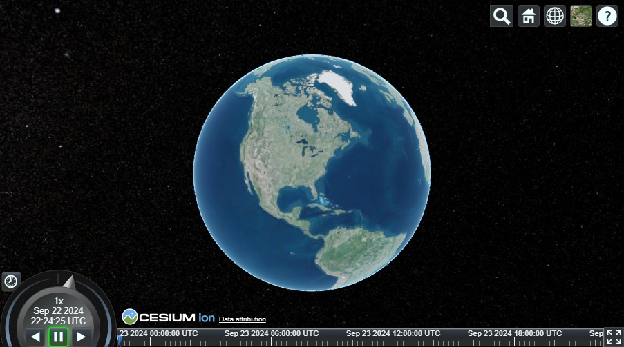

# Cesium React Vite Starter

This project is a starter template for building 3D geospatial applications using Cesium, React, and Vite. *Dependencies are up to date as of September 22, 2024.*

## Getting Started

### Prerequisites
1. Follow the instructions [here](https://cesium.com/learn/cesiumjs-learn/cesiumjs-quickstart) to get a Cesium Ion token.

2. Create a `.env` file at the root of this repository and set `VITE_CESIUM_TOKEN` to your Cesium Ion token.

### Installation

1. Clone this repository.
2. Navigate to the project directory.
3. Install dependencies by running `npm install`.

### Running the Application

To start the development server: 
1. Run `npm run dev`.
2. Open `http://localhost:3000` in your browser.

### Building for Production

To build the application for production, run `npm run build`.

This will create an optimized build in the `dist` folder.
